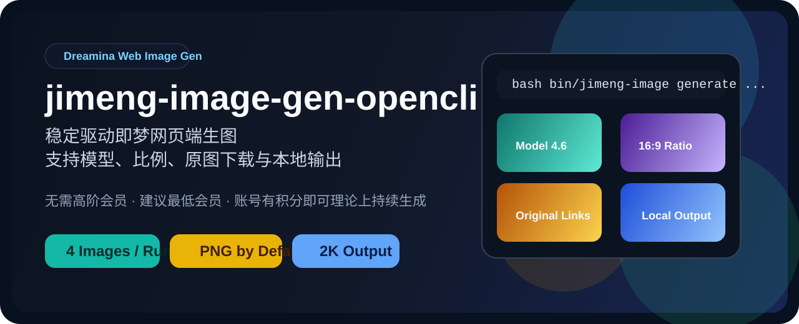
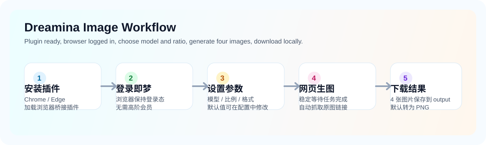
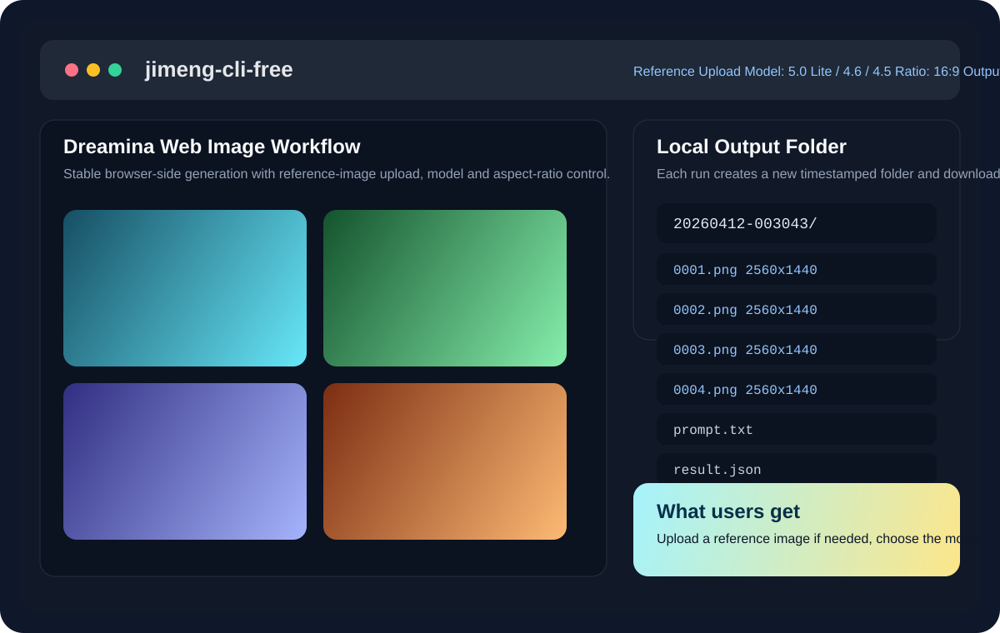

# 🎨 jimeng-cli-free

[](./LICENSE)
[](#-环境要求)
[](#-环境要求)
[](#-项目特色)

[🇺🇸 English](./README.en.md)

一个专门用于**即梦网页端生图**的本地技能。  
支持模型选择、比例选择、稳定自动化、参考图上传、图片编辑、原图下载，以及自动将 `webp` 转成 `png/jpg`。





## ✨ 项目特色

- 🚀 不需要开通即梦高阶会员，也可以直接使用即梦网页端生图
- 🆓 理论上只要你的即梦账号还有积分，就可以继续生成图片
- 💡 建议使用即梦最低会员，可获得更流畅的生图体验
- 🖼️ 支持以下模型：
  - `high_aes_general_v47`：图片4.7
  - `high_aes_general_v50`：图片5.0 Lite
  - `high_aes_general_v42`：图片4.6
  - `high_aes_general_v45`：图片4.5
  - `high_aes_general_v41`：图片4.1
  - `high_aes_general_v40`：图片4.0
- 📐 支持以下比例：
  - `smart`
  - `21:9`
  - `16:9`
  - `3:2`
  - `4:3`
  - `1:1`
  - `3:4`
  - `2:3`
  - `9:16`
- 📥 每次自动下载 1 张结果图到本地 `output/`
- 🖼️ 支持上传参考图：
  - 本地图片路径
  - 图片 URL
  - 系统剪贴板中的图片
- 💡 如果上传参考图，建议优先使用：
  - `high_aes_general_v47`：图片4.7
  - `high_aes_general_v50`：图片5.0 Lite
  - `high_aes_general_v42`：图片4.6
- 🔄 默认把下载结果转成 `png`，也可改成 `jpg` 或 `webp`
- 🔓 项目采用 **Apache-2.0** 开源协议

## 🧰 环境要求

- macOS
- `node`、`npm`、`git`、`gh`、`curl`、`tar`、`unzip`
- 已安装 **Google Chrome** 或 **Microsoft Edge**
- 需要手动安装浏览器桥接插件
- 浏览器中已登录即梦网页端

## ⚡ 快速开始

### 1. 克隆仓库

```bash
git clone https://github.com/leigegehaha/jimeng-cli-free.git
cd jimeng-cli-free
```

### 2. 准备环境

```bash
bash bin/jimeng-cli-free ensure
```

这一步会做两件事：

- 下载浏览器插件到本地 `downloads/`
- 检查浏览器与即梦登录状态

插件下载完成后，默认位置通常是：

- 压缩包：`downloads/opencli-extension.zip`
- 解压目录：`downloads/opencli-extension/unpacked`

### 3. 在浏览器中手动加载插件

这是关键步骤，首次使用必须完成。

#### Chrome 加载方式

1. 打开 `chrome://extensions`
2. 打开右上角 `开发者模式`
3. 点击 `加载已解压的扩展程序`
4. 选择仓库里的目录：

```bash
downloads/opencli-extension/unpacked
```

#### Edge 加载方式

1. 打开 `edge://extensions`
2. 打开左侧或右上角的 `开发人员模式`
3. 点击 `加载解压缩的扩展`
4. 选择仓库里的目录：

```bash
downloads/opencli-extension/unpacked
```

#### 如何确认插件已正确加载

- 浏览器扩展页面里可以看到新加载的插件
- 插件状态应为已启用
- 浏览器不要处于完全关闭状态，建议保持至少一个窗口打开

如果这一步没做对，后续生成通常会报：

- 浏览器未连接
- 插件未安装
- 无法获取页面数据

### 4. 登录即梦网页端

在刚刚加载插件的同一个浏览器里打开：

- `https://jimeng.jianying.com`

然后完成登录。  
建议直接打开即梦生图页面并确认页面可正常操作。

### 5. 开始生图

```bash
bash bin/jimeng-cli-free generate "青绿色玻璃建筑与植物，横版海报" --model high_aes_general_v42 --aspect 16:9
```

支持参考图上传：

```bash
bash bin/jimeng-cli-free generate "保留主体构图，改成电影海报风格" --reference ./ref.png --mode reference
bash bin/jimeng-cli-free generate "保留主体构图，改成电影海报风格" --reference https://example.com/ref.png --mode reference
bash bin/jimeng-cli-free generate "保留主体构图，改成电影海报风格" --clipboard --mode reference
```

如果上传参考图，建议优先使用以下模型：

- `high_aes_general_v47`：图片 4.7
- `high_aes_general_v50`：图片 5.0 Lite
- `high_aes_general_v42`：图片 4.6

如果你想在生成前再次检查环境，可以执行：

```bash
bash bin/jimeng-cli-free ensure
```

## 🤖 安装到多个 Agent / 智能体

```bash
bash scripts/install_links.sh
```

默认会把这个 skill 软链接安装到：

- `~/.agents/skills`
- `~/.claude/skills`
- `~/.opencode/skills`
- `~/.workbuddy/skills`
- `~/.codebuddy/skills`

安装后，任意 agent 在任意目录都能识别并调用本 skill。外部 agent 推荐通过环境变量定位 CLI，并用 `--output` 把结果直接落到当前工作目录：

```bash
# 定位 CLI（可移植，推荐）
export JIMENG_CLI_DIR="/path/to/jimeng-cli-free"

# 在任意目录生图，结果直接落到当前目录
bash "$JIMENG_CLI_DIR/bin/jimeng-cli-free" generate "你的提示词" --aspect 16:9 --output "$(pwd)"

# 不加 --output 时，结果默认落到 <仓库>/output/<时间戳>/0001.png
```

- `generate` 的 `<提示词>` 必须是命令后第一个非 `--` 的参数。
- 默认模型 `high_aes_general_v47`、比例 `9:16`、格式 `png`、每次 1 张图（均可在 `config.json` 改）。
- 完整命令、参数表、退出码见 `bash bin/jimeng-cli-free help`，对外使用说明见 [`SKILL.md`](./SKILL.md)。

## 🖼️ Demo



## ⚙️ 配置项

修改 [config.json](./config.json)：

- `default_model`
- `default_aspect`
- `default_output_format`
- `default_workspace`
- `auto_create_workspace`
- `runtime_source_mode`
- `runtime_pinned_commit`

## 📌 使用说明

- 首次运行会真实消耗即梦额度
- 使用前请先在浏览器登录 `https://jimeng.jianying.com`
- 浏览器插件需要从 unpacked 目录手动加载
- 如果插件未正确加载，项目基本无法正常工作

## 🧭 后续开发计划

1. 继续增强参考图生图与图片编辑体验
2. 持续修复 bug 与稳定性问题
3. 添加视频生成功能

说明：
- 为了和图片生成能力解耦，视频生成功能大概率会单独做成一个新的插件，请期待

## ⚠️ 重要提醒

- 本项目全部代码采用 `vibe coding` 方式完成，主要使用 `GLM 5.1` 模型
- 当前代码**没有经过完整人工审核**，因此仍然可能存在未知 bug、边界问题和平台兼容性问题
- 本项目目前在 **macOS** 上完成了真实测试并验证可用
- **Windows** 和 **Linux** 理论上也可以使用，但由于各平台的终端、浏览器调用方式和路径处理差异，可能出现未知问题
- 如果你在 Windows 或 Linux 上遇到问题，欢迎提 PR，或者直接使用 Claude、Codex、GLM 5.1 等 AI 工具辅助排查和修复
- AI 时代，善用 AI

## 🛠️ 故障排查

如果运行出现问题，建议优先检查：

1. 浏览器是否正确安装并正常打开
2. 浏览器插件是否已经正确加载
3. 即梦网页端是否已经登录
4. 当前账号是否还有可用积分
5. 当前网络是否能正常访问 GitHub、即梦和插件相关资源
6. `node`、`npm`、`git`、`gh`、`curl`、`tar`、`unzip` 是否都已安装
7. 是否在 macOS 以外平台运行；如果是，请优先怀疑平台兼容性问题

额外建议：

- 首次使用时，先执行一次 `bash bin/jimeng-cli-free ensure`
- 如果插件刚安装，先完全关闭并重新打开浏览器再试
- 如果不确定插件目录，优先检查 `downloads/opencli-extension/unpacked`
- 如果页面卡住或没返回结果，先检查浏览器窗口里即梦页面是否仍处于可操作状态
- 如果输出目录没有新图片，先看 `result.stderr.log` 和 `result.json`
- 如果用了 `--output <目录>` 失败，确认目标路径可写、父目录存在；脚本会尝试 `mkdir -p`，权限不足会以退出码 `1` 退出

## ⚖️ 许可证与致谢

- 本项目采用 [Apache-2.0](./LICENSE)
- 本项目包含基于上游项目修改而来的衍生代码，详见 [NOTICE](./NOTICE)
- 上游来源与归属说明已保留，以避免许可证适用错误

## 🌐 GitHub 展示建议

- 仓库首页已经包含流程图和 demo 展示板
- 额外提供了一张可作为 GitHub Social Preview 的图片：
  - [assets/social-preview.svg](./assets/social-preview.svg)
- 由于 GitHub CLI 当前不支持直接设置仓库 Social Preview 图片，建议你在仓库设置页手动上传这张图
